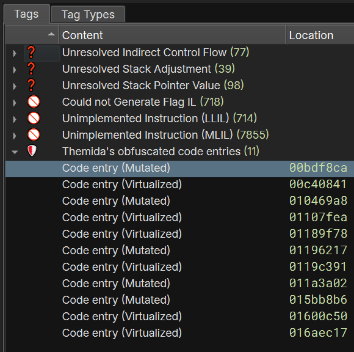

# themida-spotter-bn  [](https://img.shields.io/badge/rust-1.79.0%2B-orange.svg)

A Binary Ninja plugin that detects and tags obfuscated code entry patterns from
Oreans Technologies's software obfuscators (_i.e._, WinLicense, Themida and Code
Virtualizer), in order to help reverse engineers focus on interesting code.

## Screenshot

<p align="center">
  
</p>

# Supported Targets

The plugin has been tested on **x86** and **x86_64** executables protected with
Oreans's products up to version **3.1.9**.

# How to Build

```
git clone https://github.com/ergrelet/themida-spotter-bn && cd themida-spotter-bn
cargo build --release
```

The plugin will then be available at `target/release/themida_spotter_bn.dll` if
you're on Windows for example.

Note: the plugin is build against `v4.1.5747-stable` by default but you can change
the version in `Cargo.toml` to build against your version of Binary Ninja if needed.

## How to Install

Check out the official Binary Ninja documentation to know where to copy the
files:
[Using Plugins](https://docs.binary.ninja/guide/plugins.html)
